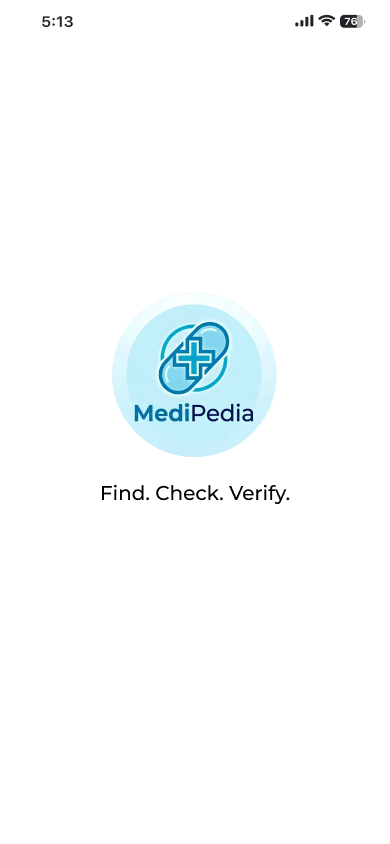
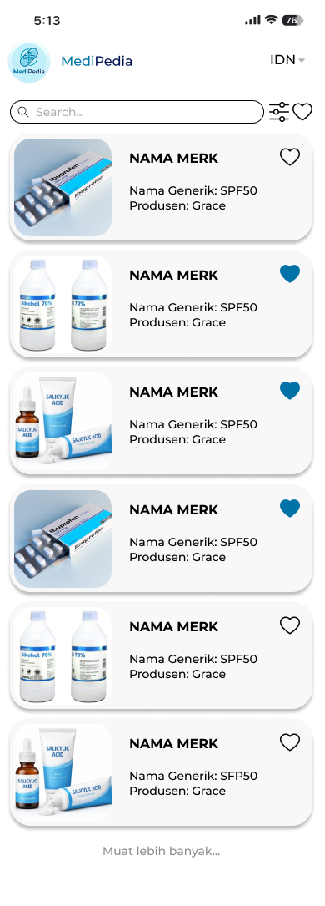
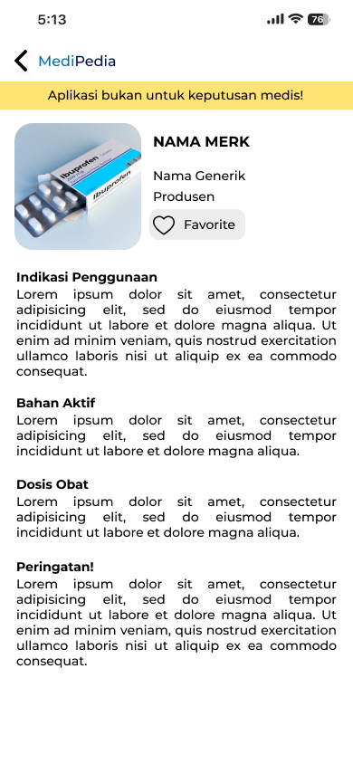
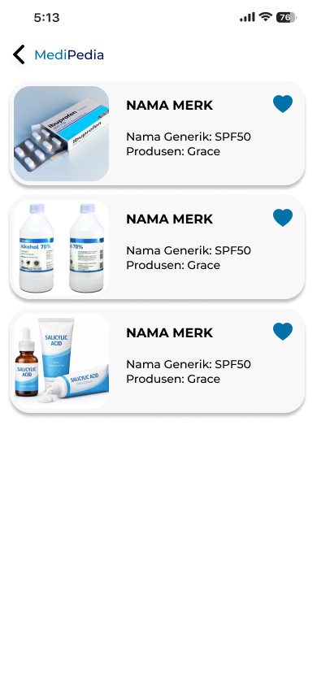
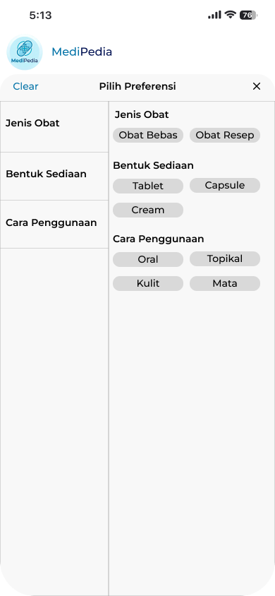

# MediPedia

MediPedia adalah aplikasi referensi obat berbasis Flutter yang menggunakan
OpenFDA Drug Labeling API. Aplikasi ini membantu pengguna mencari obat, melihat
detail obat, menggunakan filter, menyimpan favorit, dan membaca konten dalam
bahasa Inggris atau bahasa Indonesia.

## Fitur

- Daftar obat dari OpenFDA.
- Pencarian berdasarkan nama merek, nama generik, produsen, dan indikasi.
- Pencarian bertingkat berdasarkan relevansi.
- Pagination, load more, dan pull-to-refresh.
- Filter jenis obat, bentuk sediaan, dan cara penggunaan.
- Detail obat dan informasi medis yang tersedia dari API.
- Favorit yang tersimpan secara lokal.
- Lokalisasi English dan Indonesia.
- Penerjemahan konten medis menggunakan Google ML Kit on-device.
- Loading state, empty state, error state, dan retry.
- Penanganan data API yang kosong atau tidak lengkap.

## Teknologi

- Flutter: 3.19.6
- Channel: stable
- Dart: 3.3.4
- DevTools: 2.31.1
- State management: Flutter Bloc/Cubit
- API: OpenFDA Drug Labeling API
- Local persistence: SharedPreferences
- Translation: Google ML Kit Translation
- Testing: Flutter Test, Bloc Test, dan Mocktail

## Persyaratan

Pastikan perangkat sudah memiliki:

- Flutter SDK 3.19.6 atau versi yang kompatibel.
- Android SDK.
- Android emulator atau perangkat Android fisik.
- Java/JDK yang kompatibel dengan Gradle proyek.
- Koneksi internet untuk mengambil data OpenFDA dan mengunduh model bahasa
  ML Kit.

Aplikasi Android menggunakan minimum SDK 21. Tidak diperlukan API key atau
kredensial privat untuk menjalankan aplikasi ini.

## Setup

Clone repository dan masuk ke folder proyek:

```bash
git clone https://github.com/yuristaindani/medipedia.git
cd medipedia
```

Pasang dependency:

```bash
flutter pub get
```

## Menjalankan di Android Emulator

Lihat emulator Android yang tersedia:

```bash
flutter emulators
```

Jalankan emulator yang dipilih:

```bash
flutter emulators --launch <emulator_id>
```

Contoh:

```bash
flutter emulators --launch Pixel_8_Pro
```

Pastikan emulator sudah terdeteksi sebagai perangkat Android:

```powershell
& "$env:LOCALAPPDATA\Android\Sdk\platform-tools\adb.exe" devices
```

Setelah emulator muncul dengan status `device`, jalankan aplikasi:

```bash
flutter run -d emulator-5554
```

Jika ID emulator berbeda, gunakan ID yang ditampilkan oleh `adb devices`.

### Catatan ML Kit

MediPedia menggunakan Google ML Kit untuk menerjemahkan konten medis ke bahasa
Indonesia. Fitur penerjemahan ini hanya dapat dijalankan pada emulator Android
atau perangkat Android fisik.

Flutter Web tidak digunakan untuk menguji fitur penerjemahan karena plugin ML Kit
on-device tidak mendukung platform Web. Pengujian penerjemahan dilakukan melalui
emulator atau perangkat Android.

Aplikasi tetap membutuhkan koneksi internet untuk mengambil data obat dari
OpenFDA dan mengunduh model bahasa ML Kit ketika model belum tersedia di
perangkat.

## Menjalankan Test

Jalankan seluruh pengujian:

```bash
flutter test
```

Pengujian mencakup:

- parsing response OpenFDA yang berhasil;
- response error dan data invalid;
- HTTP 429, retry, dan backoff menggunakan mock;
- repository dan local persistence;
- transisi state Cubit;
- widget daftar, detail, favorit, filter, dan splash;
- loading, empty, error, dan translation fallback.

Pengujian rate limit menggunakan mock atau fake sehingga tidak mengirim
permintaan berlebihan ke API OpenFDA asli.

Jalankan static analysis:

```bash
flutter analyze
```

Regenerasi file lokalisasi setelah mengubah file ARB:

```bash
flutter gen-l10n
```

## Rancangan UI

Gambar berikut adalah rancangan UI awal yang digunakan sebagai acuan
pengembangan MediPedia.

### Splash Page



### Medication List Page



### Detail Medication Page



### Favorites Page



### Filter Page



## Struktur Arsitektur

```text
lib/
├── core/
├── data/
│   ├── datasources/
│   ├── models/
│   ├── repositories/
│   └── services/
├── domain/
│   ├── entities/
│   └── repositories/
├── l10n/
├── presentation/
│   ├── cubit/
│   ├── pages/
│   └── widgets/
└── main.dart
```

- `data` menangani API, model, persistence, dan implementasi repository.
- `domain` berisi entity dan kontrak repository.
- `presentation` berisi halaman, widget, dan Cubit.
- `core` berisi konfigurasi umum, exception, theme, dan utilitas.
- `l10n` berisi resource bahasa English dan Indonesia.

Dependency dibuat melalui constructor dan `RepositoryProvider`.

## Lokalisasi

File bahasa berada di:

```text
lib/l10n/app_en.arb
lib/l10n/app_id.arb
```

Konfigurasi generator berada di `l10n.yaml`. UI mendukung English sebagai bahasa
default dan Bahasa Indonesia melalui pilihan bahasa di header.

Konten naratif obat seperti indikasi, tujuan penggunaan, bahan aktif, dosis, dan
peringatan diterjemahkan menggunakan Google ML Kit ketika bahasa Indonesia
dipilih.

Nama merek, nama generik, dan produsen tetap menggunakan data asli OpenFDA.

## Keterbatasan yang Diketahui

- Aplikasi tidak dapat digunakan secara penuh tanpa koneksi internet karena data
  obat diambil dari OpenFDA.
- Jika model bahasa Indonesia ML Kit gagal diunduh, konten medis tidak dapat
  diterjemahkan secara otomatis.
- Hasil terjemahan istilah medis mungkin tidak selalu sempurna.
- Beberapa data OpenFDA tidak lengkap atau memiliki format yang berbeda.
- Aplikasi belum menyediakan contoh foto obat sebagai penunjang informasi.
- Penyimpanan favorit masih menggunakan SharedPreferences dan belum tersinkronisasi
  ke akun pengguna.
- Fitur chatbot medis belum tersedia.

Jika terjemahan gagal, teks asli dari API tetap ditampilkan agar informasi obat
tetap dapat diakses pengguna.

## Perkiraan Waktu Pengerjaan

Pengerjaan MediPedia, termasuk research, perancangan, implementasi, perbaikan UI,
lokalisasi, integrasi API, dan testing, memerlukan waktu sekitar 3–4 hari.

## Pengembangan Selanjutnya

Jika memiliki waktu lebih, saya akan:

- menambahkan contoh foto obat sebagai penunjang informasi;
- meningkatkan normalisasi teks dari OpenFDA;
- menambahkan cache atau database lokal untuk dukungan offline;
- menambahkan pengujian untuk lebih banyak variasi response API;
- mengintegrasikan MediPedia sebagai modul khusus di dalam aplikasi Sobat Bunda.
